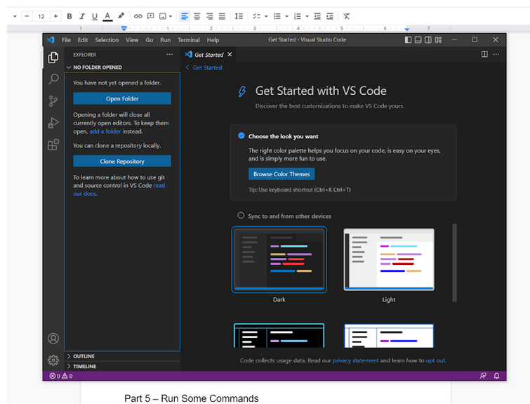
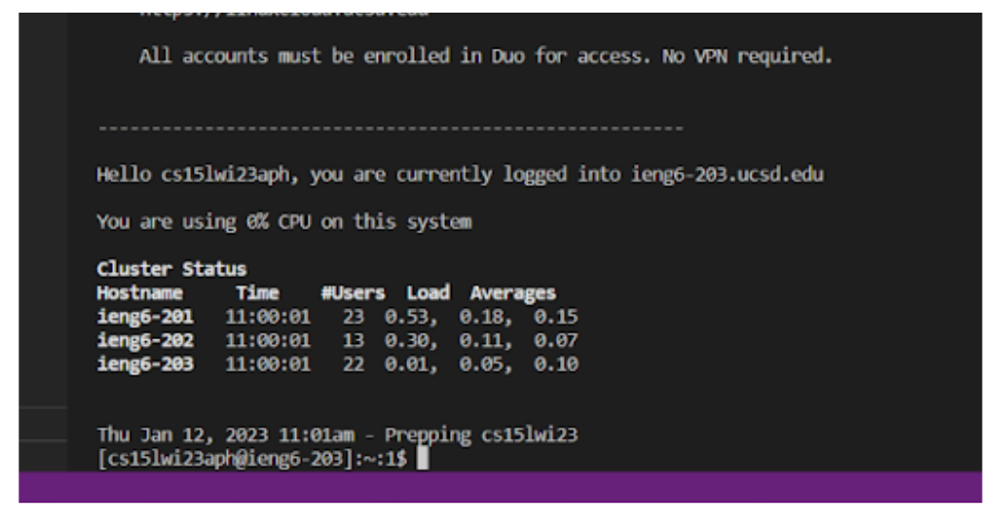

## How to Login to ieng6

# Step 1: Installing VSCode
VSCode is a program and code editor that can be used to create and edit programs both locally and on a server. It can be installed from it's [website](https://code.visualstudio.com/). 

