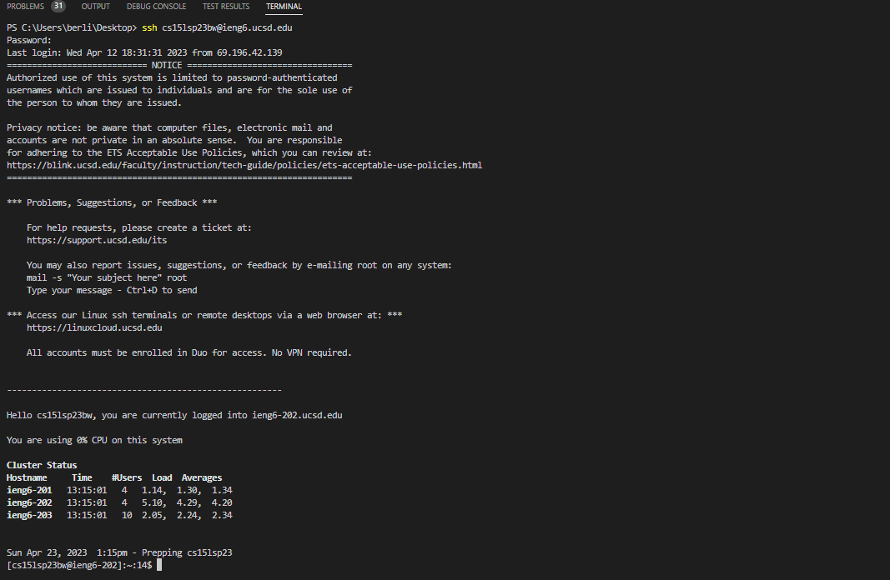
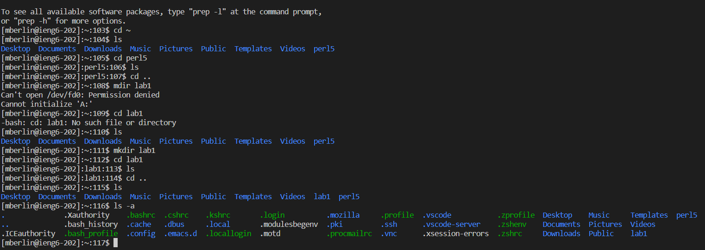

# How to Login to ieng6

## Step 1: Installing VSCode
VSCode is a program and code editor that can be used to create and edit programs both locally and on a server. It It is free and open source, and can be installed from it's [website](https://code.visualstudio.com/). To install VS Code, follow these steps:

1. Go to the VS Code website and click on the Download button for your operating system (Windows, Mac, or Linux).
2. Run the installer and follow the instructions on the screen.
3. Once the installation is complete, you can launch VS Code.

If the installation was successful, when you launch VS Code you should see a similar window to this:  

## Step 2: Connecting remotely to ieng6
Before connecting to ieng6 (UCSD's dedicated servers for CS related majors), two initial setup steps must be completed. First, you need to find your CSE15L username. This can be done on UCSD's [Account Lookup website](https://sdacs.ucsd.edu/~icc/index.php). Enter your username and student ID in the top two boxes and click "Submit" directly under. On the next page you should see your CSE15L username underneath the section entitled "Additional Accounts" near the top of the page. It should take the form of a button with the text "cs15lsp23xx", where "xx" is unique to you. Write down your username so you don't forget it.

The second step to connect to ieng6 is to reset your CSE15L password. This can be done by clicking the button containing your username and then clicking "Global Password Change Tool" on the next page, or by going directly to UCSD's [password reset website](password.ucsd.edu). In the text entry box that says to "Enter your username", enter your course username ("cs15lsp23xx") and on the next page reset your password. Remember your password because you will need it for the next step! (Note: It may take up to 15 minutes for the password change to take effect)

Now that your account is setup, you can connect to UCSD servers for CSE 15L remotely through a program called ssh in the command window. Open the command window in VS Code by clicking View -> Terminal in the top bar. You can remotely connect through ssh to UCSD servers using the following command:
```
ssh cs15lsp23[XX]@ieng6.ucsd.edu
``` 
As before, [XX] should be replaced with the unique letters for your username. After entering this command, you will be prompted for your CSE15L password (the same one you just reset). When you type your password, it will be invisible and won't appear on the screen. Don't worry, this is a normal part of SSH and your password is entering correctly (just be careful to not make any typos)! If you successfully login, you should see this window:


## Step 3: Trying some commands
You can try some commands to move around the filesystem in the server you have connected to:

* `pwd : prints the directory you are currently in`

* `ls : lists the files in the directory you are currently in`

* `cd folder: move to a sub directory called "folder" (or a parent directory using cd ..)`

* `mkdir folder : make a new directory called "folder"`

* `rmdir folder : remove a directory called "folder"`

* `touch fileName.txt : make a new file called "fileName.txt" (any other extension besides ".txt" can also be used)`

* `rm fileName.txt : removes a file called "fileName.txt"`

* `nano fileName.txt : opens the file "fileName.txt" in a simple in-terminal text editor`

* `cat fileName : prints the contents of a file called "filename"`

* `exit : exits ssh`

Here are some examples of what a sample of these commands should look like and do in ssh:


## Conclusion

In conclusion, connecting to a server through VSCode and ssh is both convienent and useful! Have fun and explore what you can do!
